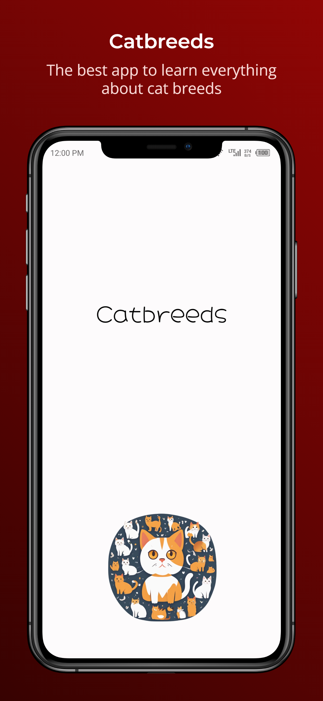
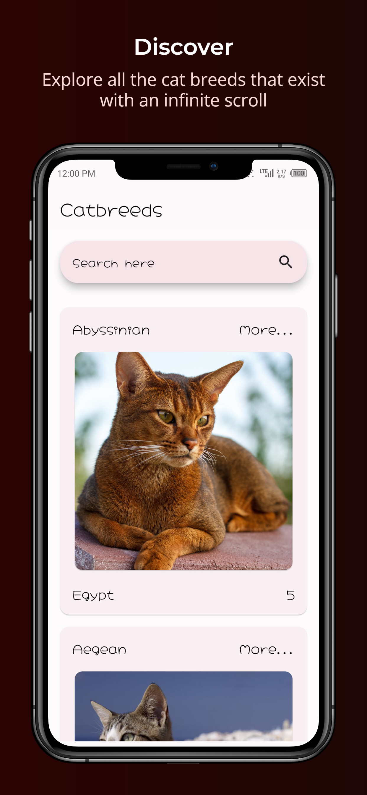
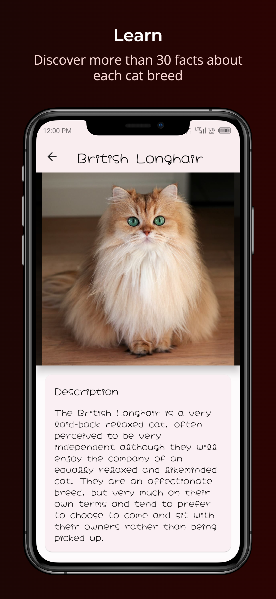
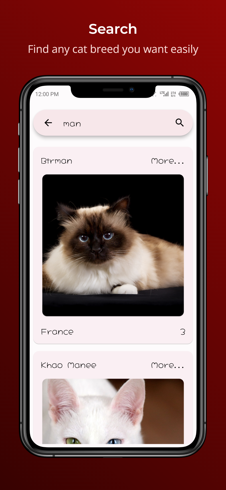
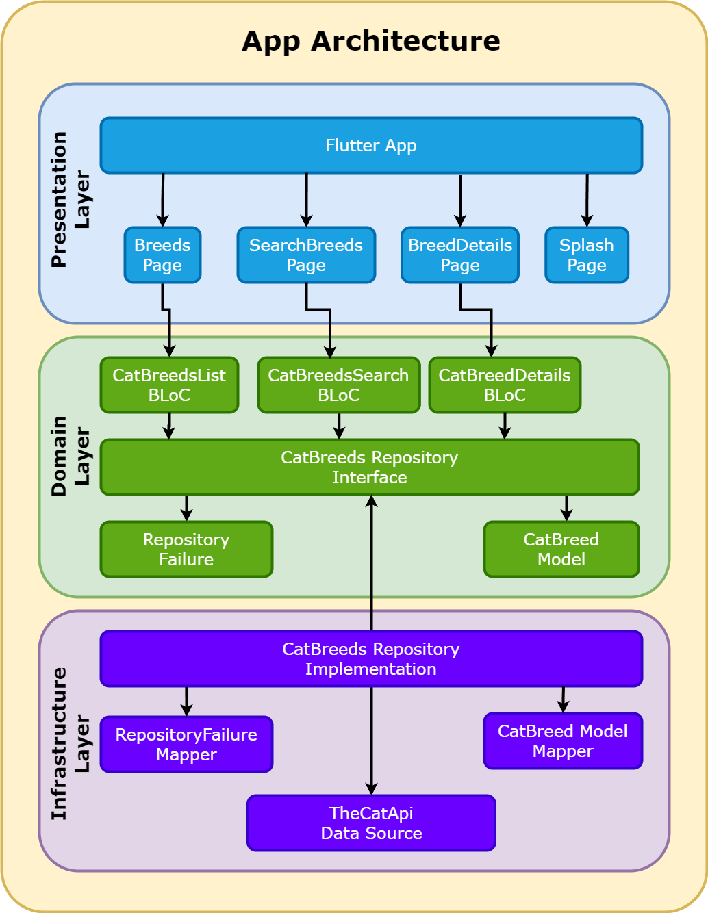

# Catbreeds

The best app to learn everything about cat breeds.

## 🔥 Web Demo 🔥

* Home: <https://GiancarloScript.github.io/catbreeds/>
* Breed Details: <https://GiancarloScript.github.io/catbreeds/#/breeds/details/bamb>
* Breeds Search: <https://GiancarloScript.github.io/catbreeds/#/breeds/search>

## Available platforms

* 🌐 Web
* 📱 Android
* 💻 Windows

<div>
    <table>
        <tr>
            <td>
                <a>
                    
                </a>
            </td>
            <td>
                <a>
                    
                </a>
            </td>
        </tr>
        <tr>
            <td>
                <a>
                    
                </a>
            </td>
             <td>
                <a>
                    
                </a>
            </td>
        </tr>
    <table>
</div>

## Architecture

The app was designed using a clean architecture.

 

## Project Structure

```text
📦app
 ┣ 📂assets
 ┣ 📂lib
 ┃ ┣ 📂config
 ┃ ┣ 📂domain
 ┃ ┃ ┣ 📂blocs
 ┃ ┃ ┣ 📂failures
 ┃ ┃ ┣ 📂models
 ┃ ┃ ┣ 📂repositories
 ┃ ┣ 📂infrastructure
 ┃ ┃ ┣ 📂data_sources
 ┃ ┃ ┣ 📂repositories
 ┃ ┣ 📂packages
 ┃ ┣ 📂presentation
 ┃ ┃ ┣ 📂pages
 ┃ ┃ ┣ 📂providers
 ┃ ┃ ┣ 📂router
 ┃ ┃ ┣ 📂themes
 ┃ ┃ ┣ 📂widgets
 ┃ ┃ ┗ 📜app.dart
 ┃ ┣ 📜main.dart
 ┃ ┣ 📜main_dev.dart
 ┃ ┗ 📜main_prod.dart
 ```

## Testing and TDD

We know that testing is very important to guarantee the quality of our applications and above all to be able to maintain it and add functionality to them with confidence that nothing will be damaged in the process.

But sometimes there is not enough time to test everything, and you have to know what to focus on, which is why the recommendation is always to test the most important components of the application, starting with the business logic.

In the case of this application, the business logic is encapsulated in the Business Logic Components known as BLoCs.

For this reason, all BLoCs were implemented using Test Driven Development known as TDD, in order to guarantee their functionality from the beginning.

* [CatBreedsListBloc Tests](./test/domain/blocs/cat_breeds_list/cat_breeds_list_bloc_test.dart).
* [CatBreedDetailsBloc Tests](./test/domain/blocs/cat_breed_details/cat_breed_details_bloc_test.dart).
* [CatBreedsSearchBloc Tests](./test/domain/blocs/cat_breeds_search/cat_breeds_search_bloc_test.dart).
* [BreedsPage Tests](./test/presentation/pages/src/breeds/breeds_page_test.dart).

## Flavors

By default, the production flavor is used.

### Development

It uses repositories implementations with local data, so it doesn't connect to any server.

Advantages:

* Faster development:
  * No need to wait for server responses.
  * You can manage the responses to test different scenarios.
* Save money:
  * Most servers generate a cost per use, so it is not worth spending unnecessary resources while developing.

**How to run it?**

* Using the vs code launch configuration `Flutter - Development`.
* Running the following command:

  ```sh
  flutter run --target lib/main_dev.dart
  ```

### Production

It uses real repositories that communicate with the real servers.

**How to run it?**

* Using the vs code launch configuration `Flutter - production-`.
* Running the following command:

  ```sh
  flutter run --target lib/main_prod.dart
  ```

## Features

The app has a beautiful material 3 and responsive design.

### Splash Page

* Amazing logo created using stable diffusion artificial intelligence.

### Breeds List Page

* Infinite scroll with server pagination.

### Breeds Search Page

* Auto search when typing, but with a debounce feature to avoid unnecessary requests to the server.

### Breeds Details Page

* If you go to the page directly, for example using the url in the browser, the data is fetched from the server.
* If you go from the breeds list or search screen, the data is passed as a parameter, improving the user experience and avoiding unnecessary requests.

## Continuous Integration and Continuous Delivery

This repository use Github Actions to run generate the web build and deploy it to Github Pages.

## Environment Variables

It is recommended to add `.env` and `.env.g.dart` extensions in the `.gitignore` file for security.

But for this project the requirement is to use a specific API key, so I decided to allow it to be in the repository to make it easier for whoever clones the repository to run the application.

## Featured Packages

The following packages were used and most of them are [Flutter Favorite](https://docs.flutter.dev/packages-and-plugins/favorites) and are widely used in the development of any application.

* [freezed](https://pub.dev/packages/freezed): Code generation for Data classes.
* [json_serializable](https://pub.dev/packages//json_serializable): Code generation for De/Serialization.
* [go_router](https://pub.dev/packages/go_router): Powerful and flexible router with code generation.
* [bloc](https://pub.dev/packages/bloc): State management.
* [bloc_test](https://pub.dev/packages/bloc_test): Test blocs easily.
* [riverpod](https://pub.dev/packages/riverpod): Dependency injection.
* [riverbloc](https://pub.dev/packages/riverbloc): Binding between riverpod and bloc.
* [rxdart](https://pub.dev/packages/rxdart): Streams utilities based on Rx.
* [mocktail](https://pub.dev/packages/mocktail): Mocking library.
* [dio](https://pub.dev/packages/dio): HTTP client.
* [collection](https://pub.dev/packages/collection): Collections utilities.
* [flutter_launcher_icons](https://pub.dev/packages/flutter_launcher_icons): Generate launcher icons.
* [flutter_lints](https://pub.dev/packages/flutter_lints): Recommended lints rules.
* [flex_color_scheme](https://pub.dev/packages/flex_color_scheme): Easy theme creation.
* [cached_network_image](https://pub.dev/packages/cached_network_image): Image caching.
* [google_fonts](https://pub.dev/packages/google_fonts): Google Fonts integration.
* [envied](https://pub.dev/packages/envied): Environment variables with type safety.
* [infinite_scroll_pagination](https://pub.dev/packages/infinite_scroll_pagination): Agnostic infinite scroll pagination widgets.

## Requirements

* [Flutter](https://flutter.dev/docs/get-started/install).

## Scripts

Before to run it, go to the scripts folder:

```sh
cd ./scripts
```

### Generate Cat Breeds Repository Dev Data

This script fetches the data from the production server and generates a file with the data to be used in the development flavor.

```sh
dart run generate_cat_breeds_repository_dev_data.dart
```

## Useful Commands

### Generate code

```sh
flutter pub run build_runner build --delete-conflicting-outputs
```

```sh
flutter pub run build_runner watch --delete-conflicting-outputs
```

## Backend

* [The Cat API](https://thecatapi.com/).
